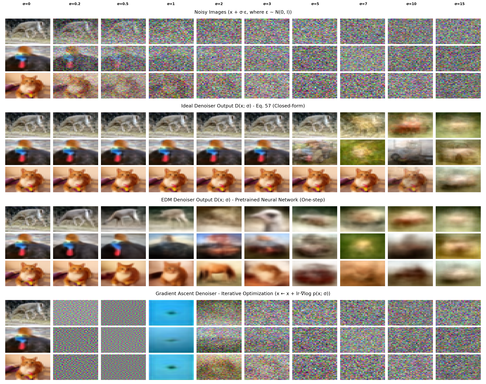
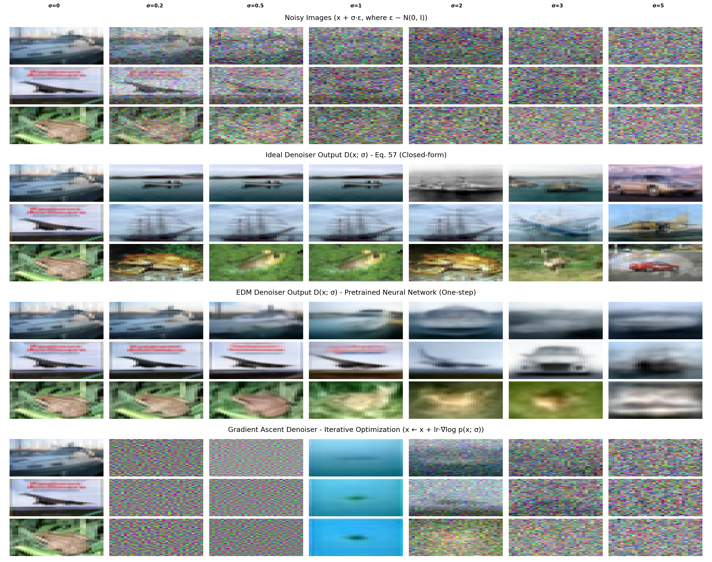

# Image Denoising Methods Comparison

A framework for comparing different image denoising methods on CIFAR-10 dataset.

## 📖 Overview

This repository provides a comparison framework for evaluating multiple image denoising methods:

1. **Ideal Denoiser** - Theoretical optimal denoiser using closed-form solution (Equation 57 from EDM paper)
2. **EDM Denoiser** - Pretrained neural network-based denoiser from the EDM paper (one-step)
3. **Gradient Ascent Denoiser** - Iterative denoising using score function optimization

The goal is to visually compare the performance of different denoising approaches across various noise levels.

## 📁 Project Structure

```
image-denoising-methods/
├── ideal_denoiser/              # Ideal denoiser module
│   └── ideal_denoiser.py       # Implementation from ideal-denoiser repository
│
├── edm_denoiser/                # EDM neural network denoiser package
│   ├── __init__.py             # Package exports
│   ├── core.py                 # Main denoising function
│   ├── model_loader.py         # Model loading, downloading, and management
│   ├── score.py                # Score function and gradient ascent
│   ├── utils.py                # Helper utilities
│   └── edm/                    # EDM dependencies (CC BY-NC-SA 4.0)
│       ├── dnnlib/             # Deep learning utilities from NVlabs/edm
│       ├── torch_utils/        # PyTorch utilities from NVlabs/edm
│       ├── LICENSE.txt         # EDM license information
│       └── NOTICE.txt          # Attribution and citation
│
├── utils/                       # Common utilities
│   ├── __init__.py
│   ├── core.py                 # Core utilities (noise, data loading, normalization)
│   ├── processing.py           # Image processing pipelines
│   └── visualization.py        # Plotting and visualization
│
├── data/                        # Dataset storage (auto-downloaded)
├── pretrain_models/             # Pretrained EDM models (auto-downloaded)
├── results/                     # Output directory for comparison results
│
├── compare_denoisers.py        # Main script to compare all denoising methods
├── requirements.txt            # Dependencies
└── README.md                   # This file
```

## 🚀 Quick Start

### Installation

```bash
# Navigate to the repository
cd image-denoising-methods

# Install dependencies
pip install -r requirements.txt
```

### Run Comparison

```bash
# Compare all three denoising methods side-by-side (default settings)
python compare_denoisers.py

# Or customize the comparison
python compare_denoisers.py --num-images 5 --train-size 5000 --device cuda
```

This will:
1. Download CIFAR-10 dataset (if needed)
2. Load pretrained EDM model (downloads ~226MB on first run)
3. Randomly select images from train and test sets
4. Generate noisy images at multiple noise levels
5. Denoise using enabled methods (all three by default)
6. Create comparison visualizations with timestamped filenames
7. Save results to specified directory (default: `./results/`)

**Expected runtime:** ~30-40 minutes on CPU, ~8-10 minutes on GPU (with default settings)

**Output files:**
- `{timestamp}_n{num}_s{sigma_min}-{sigma_max}_train{size}_{denoisers}_train.png` - Training images comparison
- `{timestamp}_n{num}_s{sigma_min}-{sigma_max}_train{size}_{denoisers}_test.png` - Test images comparison

Each figure shows (when all denoisers are enabled):
- **Row 1:** Noisy images at different noise levels
- **Row 2:** Ideal denoiser results (closed-form solution)
- **Row 3:** EDM denoiser results (one-step neural network)
- **Row 4:** Gradient ascent denoiser (iterative optimization, configurable steps)

## 📊 Results

### Training Set Comparison



### Test Set Comparison



The comparison visualizations show how each denoising method performs across different noise levels (σ = 0, 0.2, 0.5, 1, 2, 3, 5). The ideal denoiser represents the theoretical upper bound, while EDM and gradient ascent denoisers show practical learned approaches.

## 🔧 Configuration

You can customize the comparison using command-line arguments:

### Basic Usage

```bash
# Run with default settings (all denoisers enabled)
python compare_denoisers.py

# Specify number of images to process
python compare_denoisers.py --num-images 5

# Use specific sigma values
python compare_denoisers.py --sigma-list 0 0.5 1 2 5 10

# Set training subset size for ideal denoiser
python compare_denoisers.py --train-size 5000
```

### Advanced Options

```bash
# Adjust gradient ascent parameters
python compare_denoisers.py --grad-ascent-steps 20 --grad-ascent-lr 0.5

# Use CUDA for faster processing
python compare_denoisers.py --device cuda

# Set random seed for reproducibility
python compare_denoisers.py --seed 42

# Customize output directory
python compare_denoisers.py --save-dir ./my_results
```

### Selective Denoiser Comparison

```bash
# Compare only ideal and EDM denoisers
python compare_denoisers.py --denoisers ideal edm

# Compare only ideal and gradient ascent
python compare_denoisers.py --denoisers ideal grad-ascent

# Use only EDM denoiser
python compare_denoisers.py --denoisers edm
```

### Combined Examples

```bash
# Full customization example
python compare_denoisers.py \
    --num-images 5 \
    --train-size 5000 \
    --sigma-list 0 0.5 1 2 5 10 \
    --grad-ascent-steps 20 \
    --grad-ascent-lr 0.5 \
    --device cuda \
    --seed 123

# Quick test with fewer images and sigma values
python compare_denoisers.py \
    --num-images 2 \
    --train-size 500 \
    --sigma-list 0 1 5 \
    --denoisers ideal edm
```

### CLI Arguments Reference

| Argument | Type | Default | Description |
|----------|------|---------|-------------|
| `--data-root` | str | `./data` | Root directory for CIFAR-10 data |
| `--save-dir` | str | `./results` | Directory to save output images |
| `--num-images` | int | `3` | Number of images from each dataset (train/test) |
| `--train-size` | int | `1000` | Number of training images for ideal denoiser |
| `--sigma-list` | float+ | `[0, 0.2, 0.5, 1, 2, 3, 5]` | Noise levels to test |
| `--grad-ascent-steps` | int | `10` | Number of gradient ascent iterations |
| `--grad-ascent-lr` | float | `1.0` | Learning rate for gradient ascent |
| `--denoisers` | str+ | `['ideal', 'edm', 'grad-ascent']` | Denoisers to use (all by default) |
| `--device` | str | auto | Device to use (`cpu` or `cuda`) |
| `--seed` | int | `42` | Random seed for reproducibility |

## 📚 References

### Ideal Denoiser
- **Source:** [ideal-denoiser](https://github.com/mehdeh/ideal-denoiser) repository
- **Based on:** Equation 57 from EDM paper
- **License:** Free to use without restrictions

### EDM (Elucidating the Design Space of Diffusion-Based Generative Models)
- **Paper:** [arXiv:2206.00364](https://arxiv.org/abs/2206.00364)
- **Authors:** Tero Karras, Miika Aittala, Timo Aila, Samuli Laine
- **Conference:** NeurIPS 2022
- **Official Repository:** [NVlabs/edm](https://github.com/NVlabs/edm)

## 📖 Citation

If you use this code, please cite the original EDM paper:

```bibtex
@inproceedings{Karras2022edm,
  author    = {Tero Karras and Miika Aittala and Timo Aila and Samuli Laine},
  title     = {Elucidating the Design Space of Diffusion-Based Generative Models},
  booktitle = {Proc. NeurIPS},
  year      = {2022}
}
```

## 📄 License

### Main Project Code
The comparison framework and utilities are provided freely without restrictions.

### EDM Components (`edm_denoiser/edm/`)
The EDM components in `edm_denoiser/edm/` directory are from [NVlabs/edm](https://github.com/NVlabs/edm):

- **License:** Creative Commons Attribution-NonCommercial-ShareAlike 4.0 International (CC BY-NC-SA 4.0)
- **Copyright:** © 2022, NVIDIA CORPORATION & AFFILIATES
- **Usage:** Free for non-commercial research and educational purposes

For full license details, see `edm_denoiser/edm/LICENSE.txt` or visit http://creativecommons.org/licenses/by-nc-sa/4.0/

### Ideal Denoiser
The ideal denoiser module (`ideal_denoiser/ideal_denoiser.py`) is from the [ideal-denoiser](https://github.com/mehdeh/ideal-denoiser) repository and is provided freely without license restrictions.

## 🐛 Issues & Contributions

If you find any issues or have suggestions for improvements, please feel free to open an issue or submit a pull request.

---

**Note:** This framework focuses on visual comparison of different denoising methods. For detailed implementation of the ideal denoiser, see the [ideal-denoiser](https://github.com/mehdeh/ideal-denoiser) repository. For the full EDM implementation, see the [official EDM repository](https://github.com/NVlabs/edm).
